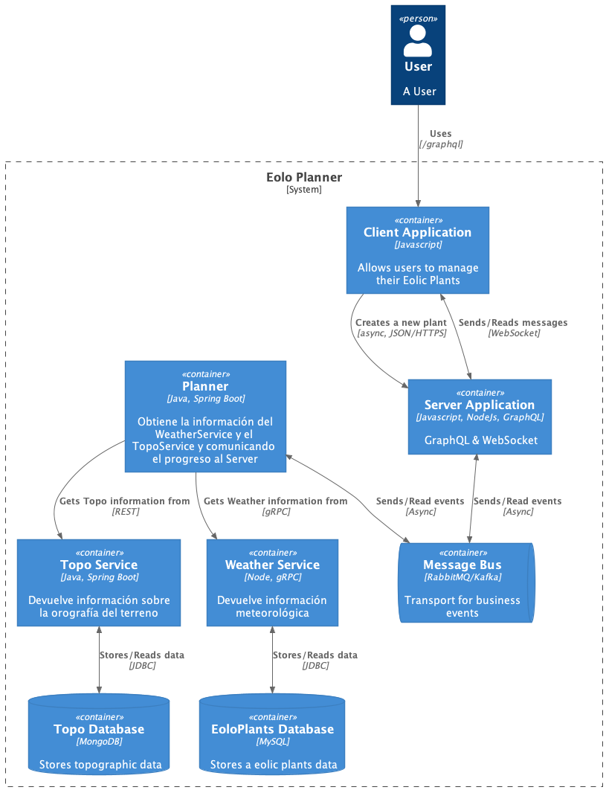

# Práctica 4. Paso de mensajes y WebSockets

## EoloPlanner V2 - Paso de mensajes y WebSockets

## System Boundary - Microservices Landscape



## Technologies used

- Java 17
- Spring Boot 2.6.1
- MySQL 5.7/8.0.22
- MongoDB 5.0.5
- RabbitMQ/Kafka

## Requirements

- Java 17
- Maven 3.5 or higher
- Docker
- Node

## Documentation

- [Requirements](./requirements.md)

Este proyecto es una aplicación distribuida formada por diferentes servicios que se comunican entre sí usando API REST, gRPC, colas de mensajes con Spring Cloud Stream y WebSockets. La aplicación ofrece un interfaz web que se comunica con el servidor con GraphQL. 

Algunos servicios están implementados con Node.js/Express y otros con Java/Spring. Estas tecnologías deben estar instaladas en el host para poder construir y ejecutar los servicios. También se requiere Docker para ejecutar los servicios auxiliares (MySQL, MongoDB, RabbitMQ y Kafka).

Para la construcción de los servicios y su ejecución, así como la ejecución de los servicios auxiliares requeridos se usan scripts implementados en Node.js. Posiblemente no sea el lenguaje de scripting más utilizado para este caso de uso, pero en este caso concreto facilita la interoperabilidad en varios SOs y es sencillo.

## Iniciar servicios auxiliares: MongoDB, MySQL, RabbitMQ y Kafka

Los servicios auxiliares se ejecutan con la tecnología de contenedores Docker usando el siguiente comando:

```
$ node exec_aux_services.js
```

## Construir servicios

Descarga las dependencias y construye los proyectos. En proyectos Java usa Maven. En proyectos Node usa NPM:

```
$ node build.js
```

## Ejecutar servicios con RabbitMQ

Ejecuta los servicios usando RabbitMQ como cola de mensajes. En proyectos Java usa Maven. En proyectos Node usa esta tecnología directamente:

```
$ node exec.js
```

## Ejecutar servicios con Kafka

Ejecuta los servicios usando Kafka como cola de mensajes. En proyectos Java usa Maven. En proyectos Node usa esta tecnología directamente:

```
$ node exec_kafka.js
```

## Github Repo

https://github.com/torrespro/practica4-eoloplannerv2
