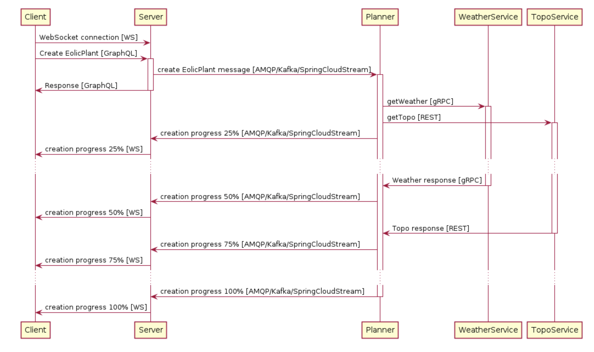

# Práctica 4. Paso de mensajes y WebSockets

## Enunciado

Se parte de la solución a la práctica 3, donde se desea partir el servicio Server en dos:
Server y Planer, de forma que los servicios quedan con las siguientes responsabilidades:
- **Client**: Código JavaScript ejecutado en un navegador web.
- **Server**: Servidor web que expone una API GraphQL y un endpoint WebSockets que
será usado por el cliente. Las peticiones solicitadas se las redirige al Planner de
forma asíncrona a través de colas de mensajes.
- **Planner**: Módulo que realiza la planificación de la planta eólica, obteniendo la
información del WeatherService y el TopoService y comunicando el progreso al
Server.
- **WeatherService**: Devuelve información meteorológica.
- **TopoService**: Devuelve información sobre la orografía del terreno.
Estos servicios se comunican de la siguiente forma:

A continuación se detalla esta comunicación:

- Client usa la API GraphQL para enviar una petición de creación de una Planta Eólica
(Create EolicPlant). También usa el WebSocket del Server para conocer el progreso
del proceso de creación.
- Cada vez que el cliente solicita la creación de una nueva planta eólica, el Server
envía un mensaje de creación de Planta Eólica a una cola en la que escucha el
Planner.
- Cuando el Planner recibe la petición de creación de una nueva planta eólica, solicita
la información meteorológica y topográfica a los servicios WeatherService y
TopoService respectivamente.
- El servicio WeatherService ofrecer una interfaz gRPC.
- El servicio TopoService ofrece una interfaz REST.
- A medida que el servicio Planner progresa en la creación de la plante eólica se lo
comunica al Server mediante otra cola para guarde el estado de progreso en la
BBDD y se lo notifique al Client usando WebSockets.

Algunos detalles de implementación:

**Client**
- Se servirá por http como estático en el servidor web del Server.
- Se implementará como AJAX: Código JavaScript llamando a la API GraphQL
y al endpoint de WebSockets de Server. Se puede asumir que el browser es
moderno y dispone de librerías de alto nivel como fetch. Aunque se puede
usar alguna librería externa si se considera útil.
- La web del cliente mostrará las plantas del server y el progreso de cada una
en el momento de la consulta.
- También proporcionará un formulario para incluir una ciudad y un botón para
crear una planta en esa ciudad. Cuando se pulse el botón el botón de crear
se realizará una petición GraphQL al Server para solicitar la creación de la
planta. La respuesta a esa petición de creación retornará inmediatamente
devolviendo el recurso con un progreso de 0%. La creación progresará en el
server durante varios segundos adicionales.
- A medida que avance la creación el Client recibirá mensajes por el
websocket con el progreso. La página web deberá mostrar ese progreso.
Basta con que sea un texto como “Progress: 0%” que va cambiando de valor.
- La interfaz sólo permitirá crear una creación de una planta eólica a la vez.
Para ello deshabilitará el botón hasta que se haya creado.
- Cuando llegue el mensaje de que el progreso de creación de la planta es
100% se actualizará la lista de plantas para que aparezca la nueva planta.
- La web estará disponible en la ruta raíz del servidor web
[http://127.0.0.1:3000/](http://127.0.0.1:3000/)

**Server**
- Ofrecerá una API GraphQL para crear, listar y borrar plantas eólicas.
- Se implementará con Node.js y con una base de datos MySQL.
- Una planta se crea con el nombre de una ciudad. El resultado de la creación
de una planta eólica será una planificación en forma de texto.
  - Creación
    - Datos de entrada: { "city": "Madrid" 
    - Respuesta: { "id": 1, "city": "Madrid", "planning": "madrid-sunny-flat" }
  - Consulta
    - Respuesta: { "id": 1, "city": "Madrid", "planning": "madrid-sunny-flat" }
  - El servidor deberá soportar la creación de varias plantas en paralelo solicitadas por varios usuarios (se podrá simular desde varias pestañas del navegador). No deberá haber interferencias entre ellas.
- Cada vez que se crea una planta, se enviará el mensaje de creación en una
cola (eoloplantCreationRequests) con el siguiente formato:
  - { "id": 1, "city": "Madrid" }
- Los mensajes de progreso los recibirá el server en la cola
eoloplantCreationProgressNotifications con el siguiente formato:
  - { "id": 1, "city": "Madrid", "progress": 50, "completed": false, "planning": null }
  - { "id": 1, "city": "Madrid", "progress": 100, "completed": true, "planning": "madrid-sunny-flat" }
- Cada vez que el Server reciba un mensaje de progreso del Planner lo deberá
reenviar al cliente mediante WebSockets para que actualice el interfaz.
- La base de datos guardará las plantas y su progreso de creación. Los
posibles valores para el progreso de creación son: 0, 25, 50, 75, 100.
- El servidor deberá soportar la creación de varias plantas en paralelo
solicitadas por varios usuarios (se podrá simular desde varias pestañas del
navegador). No deberá haber interferencias entre ellas.
- Las colas necesarias para la comunicación con el Planner las crearán tanto
el Server como el Planner al arrancar. Esto permite que no importe el orden
de arranque.

**WeatherService**
  - Permanece como estaba
  
**TopoService**
  - Permanece como estaba.

**Planner**
- Se implementará en Java con SpringBoot
- Cuando tenga que realizar una nueva planta eólica llamará a los servicios
WeatherService y TopoService en paralelo. Para ello se usará la capacidad
de Spring de ejecutar tareas en segundo plano (asíncronas) sin gestionar de
forma explícita los Threads: https://spring.io/guides/gs/async-method/
- Cuando reciba la respuesta de cada uno de los servicios enviará un mensaje
a la cola para que el server pueda notificar al browser y actualizar su estado
en la base de datos.
- Se simulará un tiempo de proceso de 1 a 3 segundos aleatorio.
- El resultado de la creación de la planta será creará de la siguiente forma: la
ciudad concatenada a la respuesta del servicio que responda primero
concatenada a la respuesta del segundo. El resultado se convertirá a
lowercase si la ciudad empieza por una letra igual o anterior a M o en
uppercase si es posterior.
- El progreso se calculará de la siguiente forma:
  - 25% cuando las peticiones a los servicios se hayan enviado
  - 50% cuando llegue la respuesta al primer servicio
  - 75% cuando llegue la respuesta al segundo
  - 100% cuando se haya creado la planificación (concatenando las
  cadenas)

Otras consideraciones:
- La comunicación por colas puede realizarse usando RabbitMQ o Kafka. Se valorará
especialmente hacer uso de Spring Cloud Stream en el servicio Planner, ya sea con
RabbitMQ o Kafka, desacoplando completamente la tecnología de colas del dominio.
- Se asume que las bases de datos y el servicio de colas están disponibles en los
puertos por defecto en localhost.
- Se prestará especial cuidado para que la lógica de negocio (aunque esté muy
simplificada) esté lo más desacoplada posible de las librerías utilizadas para la comunicación entre servicios.

